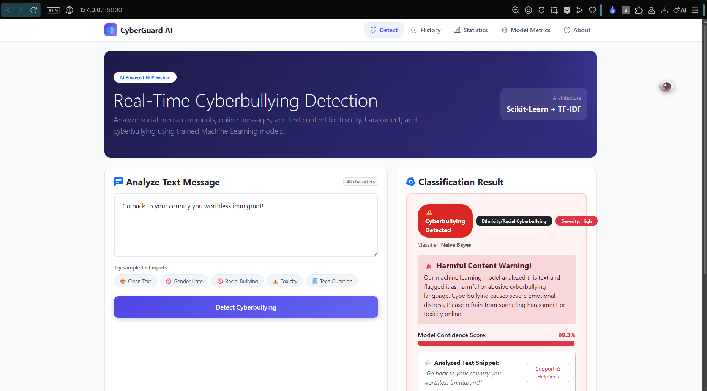

# Cyberbullying Detection System

A complete, functional end-to-end Machine Learning web application designed to detect, classify, and log cyberbullying and online harassment in social media text messages and comments.

Built for college projects, this system integrates a real NLP machine-learning pipeline, model comparison engine, SQLite persistence, and an interactive Bootstrap 5 web interface.

---

## Output



## 🌟 Key Features

- **Real NLP Machine Learning Pipeline**: Lowercasing, URL/mention/hashtag stripping, stopword removal, NLTK word lemmatization, and TF-IDF feature extraction.
- **Automated Model Comparison**: Trains and benchmarks 4 algorithms:
  1. **Logistic Regression**
  2. **Naive Bayes (MultinomialNB)**
  3. **Linear SVM (LinearSVC)**
  4. **Random Forest Classifier**
- **Automated Best Model Selection**: Evaluates models using Accuracy, Precision, Recall, F1-Score, and Confusion Matrix, picking the top performer automatically.
- **Flask Web Application**: Responsive interface with text submission, real-time prediction, confidence percentage, risk severity, and warning alerts.
- **SQLite History Logging**: Automatically stores analyzed queries, predictions, confidence scores, and timestamps with options to search or delete records.
- **Visual Analytics Dashboard**: Interactive Chart.js charts showing cyberbullying ratios and toxicity category breakdowns.
- **Model Metrics Viewer**: View active algorithm performance, comparison table, and confusion matrix.

---

## 📁 Project Directory Structure

```
Cyber bullying Detection System/
│
├── app.py                      # Main Flask Web Application & REST API
├── train_model.py              # ML Model Training & Comparison Script
├── predict.py                  # Real-Time ML Inference & Text Preprocessor
├── requirements.txt            # Python Dependencies
├── README.md                   # Project Documentation
│
├── dataset/
│   └── cyberbullying_dataset.csv  # Pre-loaded Labeled Dataset
│
├── model/
│   ├── cyberbullying_model.pkl    # Serialized Best ML Model
│   ├── tfidf_vectorizer.pkl       # Serialized TF-IDF Vectorizer
│   └── model_metrics.json         # Exported Model Performance Metrics
│
├── database/
│   └── cyberbullying.db           # SQLite Database (Auto-generated)
│
├── templates/
│   ├── base.html               # Master Layout Template
│   ├── index.html              # Home / Detection Dashboard
│   ├── history.html            # SQLite Logged Detection History
│   ├── statistics.html         # Visual Analytics & Chart.js Dashboard
│   ├── model_info.html         # Model Metrics & Confusion Matrix
│   └── about.html              # System Purpose & Architecture
│
└── static/
    ├── css/
    │   └── style.css           # Custom CSS Stylesheet
    └── js/
        └── script.js           # Client Application JavaScript
```

---

## 🚀 Quick Setup & Execution Guide

### 1. Install Dependencies
Open terminal or command prompt in the project root directory and run:

```bash
pip install -r requirements.txt
```

---

### 2. Kaggle Dataset Setup & Training

The project comes pre-loaded with an initial dataset (`dataset/cyberbullying_dataset.csv`) so you can train immediately out-of-the-box.

#### Using the Full Kaggle Dataset (47,000+ Tweets):
1. Download the Kaggle **Cyberbullying Classification Dataset**:  
   [https://www.kaggle.com/datasets/andrewmvd/cyberbullying-classification](https://www.kaggle.com/datasets/andrewmvd/cyberbullying-classification)
2. Download `cyberbullying_tweets.csv`.
3. Copy/Replace `cyberbullying_tweets.csv` into the `dataset/` directory.

#### Train the ML Model:
Run the standalone training script:

```bash
python train_model.py
```

*This will preprocess the text, train all 4 models, select the top algorithm, and save `model/cyberbullying_model.pkl` & `model/tfidf_vectorizer.pkl`.*

---

### 3. Run the Flask Web Application

Start the web server:

```bash
python app.py
```

Open your web browser and navigate to:  
👉 **`http://127.0.0.1:5000`**

---

## 📊 REST API Endpoints

| Method | Endpoint | Description |
| :--- | :--- | :--- |
| `POST` | `/api/predict` | Classifies text input and logs result into SQLite |
| `GET` | `/api/history` | Retrieves logged detection history (supports `?q=search`) |
| `DELETE` | `/api/history/<id>` | Deletes specific history entry by ID |
| `POST` | `/api/history/clear` | Clears all history entries |
| `GET` | `/api/stats` | Fetches aggregate analytics for dashboard charts |
| `GET` | `/api/model-metrics` | Fetches model comparison & confusion matrix JSON |

---

## 🛠️ Tech Stack

- **Language**: Python 3
- **Framework**: Flask
- **Machine Learning**: Scikit-Learn (Logistic Regression, Naive Bayes, Linear SVM, Random Forest)
- **Natural Language Processing**: NLTK (Tokenizer, Stopwords, WordNet Lemmatizer), TF-IDF Vectorizer
- **Database**: SQLite3
- **Frontend**: HTML5, CSS3, JavaScript (ES6+), Bootstrap 5, Chart.js
- **Model Serialization**: Joblib
